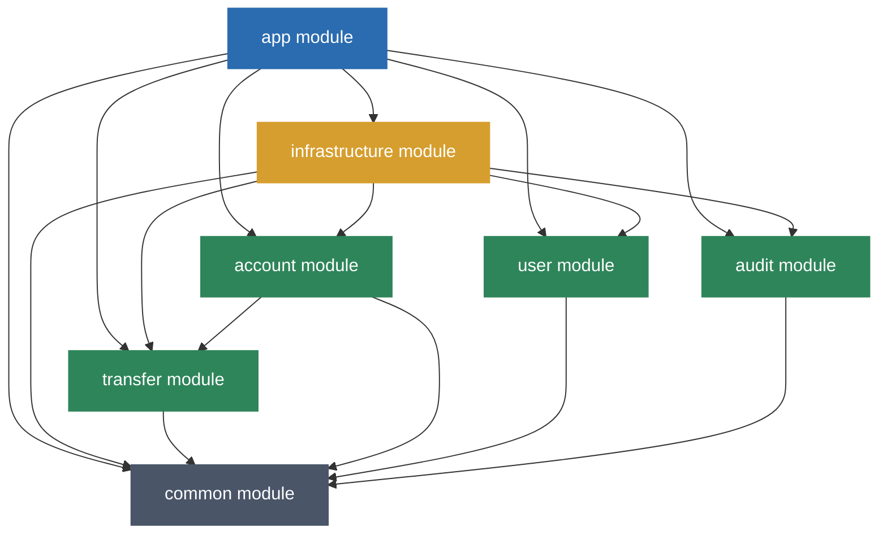

# Core Banking & Transfer System

A modular core banking and money transfer system built with **Spring Boot 3.5.x** and **Java 21**, strictly adhering to **Hexagonal Architecture (Ports and Adapters)** and **Clean Architecture** principles.

---

## Tech Stack & Prerequisites
### Core Framework & Language
- **Java 21:** Utilizes modern LTS features (e.g., Records, Pattern Matching).
- **Spring Boot 3.5.16:** Application backbone (Spring Web, AOP, Scheduling, Actuator).
- **Spring Security & JWT:** Stateless authentication and token blacklisting.

### Data & Caching
- **PostgreSQL 15:** Relational database with full transaction isolation and optimistic locking.
- **Flyway:** Automated database migration and schema version control. Migrations run on startup (`spring.jpa.hibernate.ddl-auto=validate`) to guarantee schema consistency with JPA entities.
- **Redis 7:** Caching, login attempts storage, and sliding window rate limiting (via Lua scripts).
- **Caffeine Cache:** In-memory caching fallback for development without Redis.

### Quality Assurance & Testing
- **JUnit 5 & Mockito:** Standard test suites and mocking.
- **Testcontainers:** Integration testing with a single PostgreSQL container shared across all modules.
- **ArchUnit:** Architecture verification to enforce Hexagonal boundary rules.
- **JaCoCo:** Quality gates enforcing $\ge 85\%$ Line and $\ge 70\%$ Branch coverage.
- **Pitest:** Mutation testing quality gate enforcing $\ge 80\%$ mutation coverage to verify test assertion strength.

### DevOps & Prerequisites
- **Docker & Docker Compose:** Multi-container orchestration.
- **Maven 3.9.x:** Recommended build system (Maven 3.9.16 wrapper configuration is pre-configured).
- **Prerequisites:** Java 21 JDK, Docker installed.

---

## Architecture & Module Dependency

The project follows Hexagonal Architecture rules where the domain core remains isolated from framework dependencies, and adapters depend strictly on ports. Dependency flows **inward**: infrastructure adapters depend on domain modules, never the reverse.

### Module Breakdown:
- **`app`**: Bootstraps the application (`BankApplication`) and wires all modules together. Houses all integration and WebMvc tests.
- **`common`**: Framework-independent shared domain models, value objects, exceptions, annotations, and cross-cutting ports (`ClockProviderPort`, `IdempotencyPort`, `EventPublisherPort`).
- **`infrastructure`**: Security, JWT validation, outbox poller/processor, Redis/Caffeine adapters, and global exception handling. Depends on all bounded context modules to provide their adapter implementations.
- **`user`**: User registration, authentication, token blacklisting, and brute-force lockout. Defines `ClientIpResolverPort` and `LoginAttemptPort` — their implementations live in `infrastructure`.
- **`account`**: Bank account lifecycle, balance mutations, and details. Implements `AccountAclPort` (defined in `transfer`) as an anti-corruption layer.
- **`transfer`**: Fund transfers, cancellations (24-hour window), and reporting. Defines `AccountAclPort` as an outbound port — the `account` module implements it.
- **`audit`**: Transactional audit logging triggered by commit-phase domain events via `@TransactionalEventListener(AFTER_COMMIT)`.



> [!NOTE]
> The `account → transfer` edge exists because `AccountAclAdapter` (in `account`) implements `AccountAclPort` (defined in `transfer.application.port.out`). This is a controlled anti-corruption layer dependency — the port contract belongs to `transfer`, and `account` provides the implementation. No domain module depends on `infrastructure` at compile time.

---

## REST API Endpoints (v1)

All request paths are prefixed with `/api/v1`. Endpoints below require a JWT bearer token except registration and login.

| Module | Endpoint | Method | Description | Special Headers / Notes |
| :--- | :--- | :--- | :--- | :--- |
| **User** | `/auth/register` | `POST` | Register a new user | `Idempotency-Key` (Recommended) |
| **User** | `/auth/login` | `POST` | Log in and obtain JWT | Brute-force & Rate-limited |
| **User** | `/auth/logout` | `POST` | Log out and blacklist token | `Authorization: Bearer <token>` |
| **Account** | `/accounts` | `POST` | Create a new bank account | `Authorization: Bearer <token>` |
| **Account** | `/accounts` | `GET` | List all accounts (Paged) | `Authorization: Bearer <token>` |
| **Account** | `/accounts/{id}` | `GET` | Query account details by ID | `Authorization: Bearer <token>` |
| **Account** | `/accounts/iban/{iban}` | `GET` | Query account details by IBAN | `Authorization: Bearer <token>` |
| **Transfer** | `/transfers` | `POST` | Execute a money transfer | `Idempotency-Key` (Required) |
| **Transfer** | `/transfers/{id}` | `GET` | Query transfer details by ID | `Authorization: Bearer <token>` |
| **Transfer** | `/transfers/{id}/cancel` | `POST` | Cancel a transfer (< 24 hours) | `Idempotency-Key` (Required) |
| **Transfer** | `/transfers/history/{accountId}`| `GET` | Fetch transfer history (Paged) | `Authorization: Bearer <token>` |
| **Transfer** | `/transfers/report` | `GET` | Export date-range report | `Authorization: Bearer <token>` |

---

## Key Features & Design Decisions

- **Hexagonal Architecture (Ports & Adapters):** All bounded context modules (`account`, `transfer`, `user`, `audit`) are compile-time independent of `infrastructure`. Infrastructure adapters depend on domain modules, not vice versa. Ports are owned by their defining module — `AccountAclPort` lives in `transfer.application.port.out`.
- **AOP Programmatic Transactions (`UseCaseTransactionAspect`):** Isolates transaction management from business use cases. Audit events are published via `ApplicationEventPublisher` within the transaction boundary and consumed by `@TransactionalEventListener(phase = TransactionPhase.AFTER_COMMIT)`, ensuring audit logging is only persisted on successful commit.
- **Transactional Outbox:** Reliably publishes domain events via the `outbox_events` database table. Each partition is polled independently on its own thread (`ScheduledExecutorService`, configurable `partitionCount`, default: 0). Uses `SELECT ... FOR UPDATE SKIP LOCKED` (via Hibernate `@QueryHint`) to prevent duplicate processing under concurrent polling. Outbox event handlers use idempotency-based deduplication (`IdempotencyPort.tryCreate`) to guarantee at-most-once processing of each outbox event across restarts and retries.
- **Optimistic Concurrency Control (OCC):** Prevents lost updates and double-spending on `Account` and `Transfer` entities via Hibernate `@Version`.
- **Sorted Resource Locking (Deadlock Prevention):** Acquires database locks in a consistent, sorted order of account IDs (via `OrderedPair`) during debit/credit operations to prevent deadlocks under high-concurrency transfers.
- **Bounded Context Decoupling (Anti-Corruption Layer - ACL):** The `transfer` and `account` modules communicate through the `AccountAclPort` contract (defined in `transfer`), implemented via `AccountAclAdapter` (in `account`). This protects the transfer domain from database or structure changes inside the account module.
- **AOP Idempotency Guard:** Protects write endpoints against duplicate submissions using a unique composite key stored in the `idempotency_keys` table. Authenticated endpoints use a `username_idempotencyKey` key; public endpoints (e.g., `/auth/register`) use a `clientIp_idempotencyKey` key via `ClientIpResolverPort`, configured with `@Idempotent(publicEndpoint = true)`.
- **Dynamic Security Backends:** Abstracts Rate Limiting (sliding window via Lua script), Token Blacklisting, and Brute-Force lockout, supporting both Redis (production) and Caffeine (local dev). The `LoginAttemptPort` is defined in `user`; its Caffeine and Redis implementations live in `infrastructure`.


---

## Getting Started

You can run the entire system (databases, cache, and the application itself) with a single command, or build and run it locally.

### Option A: Run Everything via Docker Compose (Recommended)
To build and spin up PostgreSQL, Redis, and the Spring Boot application together:
```bash
docker-compose up --build
```

### Option B: Build & Run Locally
1. Start PostgreSQL and Redis containers:
   ```bash
   docker-compose up -d postgres redis
   ```
2. Compile and run the application using the Maven Wrapper:
   - **Linux/macOS:**
     ```bash
     ./mvnw clean package
     ./mvnw spring-boot:run -pl app
     ```
   - **Windows (PowerShell):**
     ```powershell
     .\mvnw.cmd clean package
     .\mvnw.cmd spring-boot:run -pl app
     ```
   *(Note: Testcontainers will spin up a PostgreSQL instance automatically during the test lifecycle)*

- **Swagger UI:** `http://localhost:8080/swagger-ui/index.html`
- **Actuator Health:** `http://localhost:8080/actuator/health`

---

## Testing & Quality Gates

- **Test Suite (1200+ tests):** Unit tests reside in their respective modules; integration and WebMvc tests are consolidated in the `app` module for deployment-level coverage.
- **Verify Architecture Boundaries (ArchUnit):** Verified automatically via `ArchitectureTest.java`. This enforces:
  - **Hexagonal Architecture Guard:** Checks that domain layer does not import Spring or framework classes.
  - **Dependency Flow Validation:** Enforces that dependency always flows from adapters to ports, never the reverse — no domain module may depend on `infrastructure`.
  - **Cycle Prevention:** Guarantees no cyclic dependencies exist between Maven modules (e.g., compile-time decoupling of `transfer` and `account`).
- **Integration Testing with Testcontainers & Flyway:** Integration tests run against a real PostgreSQL via Testcontainers with Flyway migrations and `ddl-auto=validate` for schema consistency.
- **Generate Coverage Report (JaCoCo):** `./mvnw jacoco:report` (or `.\mvnw.cmd jacoco:report`)
- **Run Mutation Testing (Pitest):** `./mvnw pitest:mutationCoverage` (or `.\mvnw.cmd pitest:mutationCoverage`)
