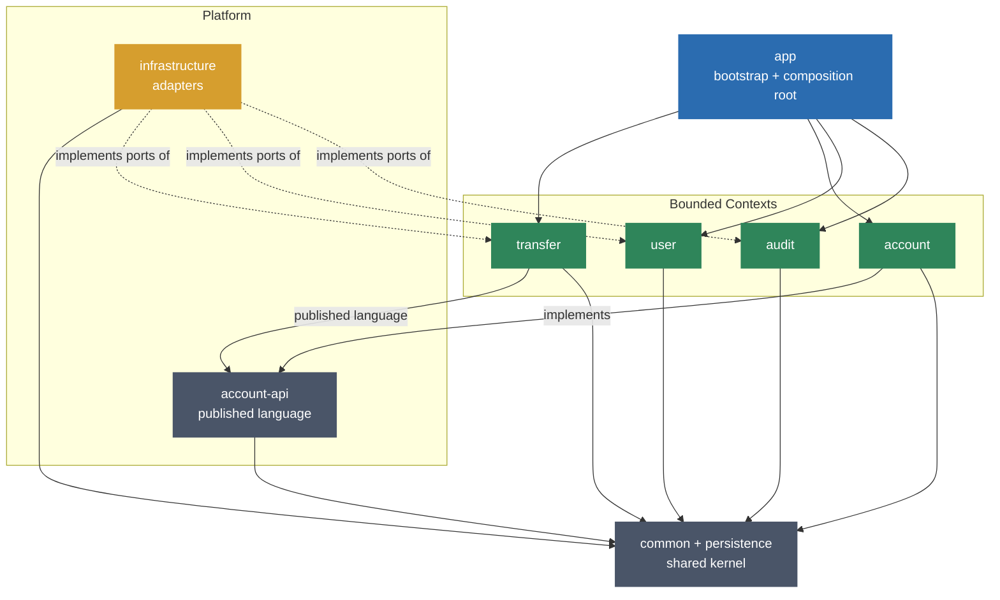

# Core Banking & Transfer System

A modular core banking and money transfer system built with **Spring Boot 3.5.x** and **Java 21**, strictly adhering to **Hexagonal Architecture (Ports and Adapters)** and **Clean Architecture** principles.

---

## Tech Stack & Prerequisites
### Core Framework & Language
- **Java 21:** Utilizes modern LTS features (e.g., Records, Pattern Matching).
- **Spring Boot 3.5.16:** Application backbone (Spring Web, AOP, Scheduling, Actuator).
- **Spring Security & JWT:** Stateless authentication and token blacklisting.

### Data & Caching
- **PostgreSQL 15:** Relational database with full transaction isolation and optimistic locking.
- **Flyway:** Automated database migration and schema version control. Migrations run on startup (`spring.jpa.hibernate.ddl-auto=validate`) to guarantee schema consistency with JPA entities.
- **Redis 7:** Caching, login attempts storage, and sliding window rate limiting (via Lua scripts).
- **Caffeine Cache:** In-memory caching fallback for development without Redis.

### Quality Assurance & Testing
- **JUnit 5 & Mockito:** Standard test suites and mocking.
- **Testcontainers:** Integration testing with a single PostgreSQL container shared across all modules.
- **ArchUnit:** Architecture verification to enforce Hexagonal boundary rules.
- **JaCoCo:** Quality gates enforcing $\ge 80\%$ Line and $\ge 70\%$ Branch coverage (single source of truth: `jacoco.line.coverage` / `jacoco.branch.coverage` in the root `pom.xml`, enforced by the `app` module `check` execution).
- **Pitest:** Mutation testing quality gate enforcing $\ge 80\%$ mutation coverage to verify test assertion strength.

### DevOps & Prerequisites
- **Docker & Docker Compose:** Multi-container orchestration.
- **Maven 3.9.x:** Recommended build system (Maven 3.9.16 wrapper configuration is pre-configured).
- **Prerequisites:** Java 21 JDK, Docker installed.

---

## Architecture & Module Dependency

The project follows Hexagonal Architecture rules where the domain core remains isolated from framework dependencies, and adapters depend strictly on ports. Dependency flows **inward**: infrastructure adapters depend on domain modules, never the reverse.

### Module Breakdown:

Modules fall into three categories: **platform** (stable, shared, no BC dependencies),
**bounded contexts** (hexagonal slices, independently understandable), and **bootstrap**.

- **`app`** [Bootstrap]: Bootstraps the application (`BankApplication`) and wires all modules together. Houses all integration and WebMvc tests, plus the `OrphanIntegrityReporter` scheduled job (read-only No-FK compensating observer).
- **`common`** [Platform — shared kernel]: Framework-independent shared domain models, value objects, exceptions, and generic cross-cutting ports (`ClockProviderPort`, `IdempotencyPort`, `EventPublisherPort`, `SecurityContextPort`, `AuthenticatedPrincipalPort`). Security-token ports (`JwtPort`, `TokenBlacklistPort`) live in `user`, not here.
- **`persistence`** [Platform]: Shared JPA base types (`AuditableJpaEntity` with Spring Data auditing). Kept as a separate module so `common` stays framework-free; `account`, `transfer` and `user` entities extend it without depending on `infrastructure`.
- **`account-api`** [Platform — published language]: Open Host Service of the Account context (`AccountApi`, `AccountSnapshot`, `AccountAdjustmentResult`). The only account-related contract downstream contexts may depend on; implemented by `account` via `AccountApiAdapter`.
- **`infrastructure`** [Platform]: Security filter chain, JWT/token-blacklist backends (implementing `user`-owned ports), outbox poller/processor, Redis/Caffeine adapters (incl. `CaffeineAccountInfoCacheAdapter` for transfer's `AccountInfoCachePort`), and global exception handling. Depends on BC port abstractions — never on BC adapter (concrete) classes, never on `account` internals.
- **`user`** [BC]: User registration, authentication, token lifecycle. Owns `JwtPort`, `TokenBlacklistPort`, `ClientIpResolverPort` and `LoginAttemptPort` — their implementations live in `infrastructure` (token/backends) or colocated adapters. Login runs as `@TransactionalUseCase` (writes login-attempt state).
- **`account`** [BC]: Bank account lifecycle, balance mutations, and details. Implements `account-api`. Publishes its own domain events; callers only see the opaque `AccountAdjustmentResult`.
- **`transfer`** [BC]: Fund transfers, cancellations (24-hour window), and reporting. Defines `AccountAclPort` (with owned `AccountInfo` + `MutationResult` types) and `AccountInfoCachePort` as outbound ports; implements them via `AccountAclAdapter` + in-memory fallback, delegating to `account-api`. Caching backend is owned by `infrastructure`. Depends on `account-api` at compile time — never on `account`; `account` does not depend on `transfer`. Money-movement endpoints (`POST /transfers`, `POST /transfers/{id}/cancel`) require `Idempotency-Key` (`@Idempotent(required=true)`).
- **`audit`** [Supporting]: Transactional audit logging triggered by commit-phase domain events via `@TransactionalEventListener(AFTER_COMMIT)`.

**Module dependencies** (arrow = compile-time dependency direction; dashed arrow = port implementation):


```mermaid
%%{init: {'flowchart': {'rankSpacing': 70, 'nodeSpacing': 50, 'curve': 'basis'}}}%%
graph TB
    classDef boot fill:#2B6CB0,stroke:#2B6CB0,color:#fff,stroke-width:2px;
    classDef ctx fill:#2F855A,stroke:#2F855A,color:#fff,stroke-width:2px;
    classDef plat fill:#4A5568,stroke:#4A5568,color:#fff,stroke-width:2px;
    classDef infraC fill:#D69E2E,stroke:#D69E2E,color:#fff,stroke-width:2px;

    app[app<br/>bootstrap + composition root]:::boot

    subgraph contexts[Bounded Contexts]
        direction LR
        transfer[transfer]:::ctx
        account[account]:::ctx
        user[user]:::ctx
        audit[audit]:::ctx
    end

    subgraph platform[Platform]
        direction LR
        api[account-api<br/>published language]:::plat
        infra[infrastructure<br/>adapters]:::infraC
    end

    shared[common + persistence<br/>shared kernel]:::plat

    app --> transfer & account & user & audit
    transfer -- published language --> api
    account -- implements --> api
    transfer & account & user & audit --> shared
    api --> shared
    infra --> shared
    infra -. implements ports of .-> transfer & user & audit
```

| Rule | Meaning |
| :--- | :--- |
| `transfer` → `account` **forbidden** | Transfer must never touch the account module at compile time — `account-api` only |
| `infrastructure` → BC adapter **forbidden** | Infra implements ports owned by the contexts, never uses concrete adapter classes |
| No-FK (V19/V22) | `accounts.user_id`, `transfers.*_account_id` are not FKs (V3 leftovers dropped in V22); integrity lives in the application layer + `OrphanIntegrityReporter` |

> The full dependency matrix is enforced at build time by `ArchitectureTest.java`; the above are the only three rules you need to know.

> [!NOTE]
> The `transfer → account-api` edge exists because `AccountAclAdapter` (in `transfer.adapter.out.account`) implements `AccountAclPort` (defined in `transfer.application.port.out`) by delegating to the Account context's published language (`AccountApi`, implemented by `AccountApiAdapter` in `account.adapter.in.api`). `transfer` never depends on the `account` module itself. Balance mutations return the transfer-owned `AccountAclPort.MutationResult` (mapped from `AccountAdjustmentResult` inside the adapter) — account domain events are published by the Account context and never cross the boundary. Reads are cached through `AccountInfoCachePort` (infrastructure Caffeine backend, in-memory fallback in transfer). Cached `AccountInfo` carries mutable `status`, so both cache backends keep an id↔IBAN reverse index: `evictById` drops the id entry *and* its IBAN entries, preventing stale status reads (e.g. ACTIVE-after-suspend) via the IBAN path. No domain module depends on `infrastructure` at compile time. `infrastructure` no longer depends on `account` internals.

---

## REST API Endpoints (v1)

All request paths are prefixed with `/api/v1`. Endpoints below require a JWT bearer token except registration and login.

| Module | Endpoint | Method | Description | Special Headers / Notes |
| :--- | :--- | :--- | :--- | :--- |
| **User** | `/auth/register` | `POST` | Register a new user | `Idempotency-Key` (Recommended) |
| **User** | `/auth/login` | `POST` | Log in and obtain JWT | Brute-force & Rate-limited |
| **User** | `/auth/logout` | `POST` | Log out and blacklist token | `Authorization: Bearer <token>` |
| **Account** | `/accounts` | `POST` | Create a new bank account | `Authorization: Bearer <token>` |
| **Account** | `/accounts` | `GET` | List current user's accounts (Paged) | `Authorization: Bearer <token>` |
| **Account** | `/accounts/{id}` | `GET` | Query account details by ID | `Authorization: Bearer <token>` |
| **Account** | `/accounts/iban/{iban}` | `GET` | Query account details by IBAN | `Authorization: Bearer <token>` |
| **Transfer** | `/transfers` | `POST` | Execute a money transfer | `Idempotency-Key` (Required) |
| **Transfer** | `/transfers/{id}` | `GET` | Query transfer details by ID | `Authorization: Bearer <token>` |
| **Transfer** | `/transfers/{id}/cancel` | `POST` | Cancel a transfer (< 24 hours) | `Idempotency-Key` (Required) |
| **Transfer** | `/transfers/history/{accountId}`| `GET` | Fetch transfer history (Paged) | `Authorization: Bearer <token>` |
| **Transfer** | `/transfers/report` | `GET` | Export date-range report | `Authorization: Bearer <token>` |

---

## Key Features & Design Decisions

- **Hexagonal Architecture (Ports & Adapters):** All bounded context modules (`account`, `transfer`, `user`, `audit`) are compile-time independent of `infrastructure`. Infrastructure adapters depend on context-owned ports, never on concrete adapter classes (e.g. `SecurityContextAdapter` consumes the framework-free `AuthenticatedPrincipalPort`, not `CustomUserDetails`). Ports are owned by their defining module — `AccountAclPort` lives in `transfer.application.port.out`, `JwtPort`/`TokenBlacklistPort` in `user.application.port.out`, the `AccountApi` published language in `account-api`.
- **AOP Programmatic Transactions (`UseCaseTransactionAspect`):** Isolates transaction management from business use cases. Audit events are published via `ApplicationEventPublisher` within the transaction boundary and consumed by `@TransactionalEventListener(phase = TransactionPhase.AFTER_COMMIT)`, ensuring audit logging is only persisted on successful commit.
- **Transactional Outbox:** Reliably publishes domain events via the `outbox_events` database table. Each partition is polled independently on its own thread (`ScheduledExecutorService`, configurable `partitionCount`, default: 2). Uses `SELECT ... FOR UPDATE SKIP LOCKED` (via Hibernate `@QueryHint`) to prevent duplicate processing under concurrent polling. Outbox event handlers use idempotency-based deduplication (`IdempotencyPort.tryCreate`) to guarantee at-most-once processing of each outbox event across restarts and retries.
- **Optimistic Concurrency Control (OCC):** Prevents lost updates and double-spending on `Account` and `Transfer` entities via Hibernate `@Version`.
- **Sorted Resource Locking (Deadlock Prevention):** Acquires database locks in a consistent, sorted order of account IDs (via `OrderedPair`) during debit/credit operations to prevent deadlocks under high-concurrency transfers.
- **Bounded Context Decoupling (Anti-Corruption Layer - ACL):** The `transfer` and `account` modules communicate only through the `account-api` published language (Open Host Service), consumed via transfer's `AccountAclPort` contract and implemented via `AccountAclAdapter` (in `transfer.adapter.out.account`) delegating to `AccountApi`. This protects the transfer domain from database or structure changes inside the account module, and account domain events never leak across the boundary.
- **AOP Idempotency Guard:** Protects write endpoints against duplicate submissions using a unique composite key stored in the `idempotency_keys` table. Authenticated endpoints use a `username_idempotencyKey` key; public endpoints (e.g., `/auth/register`) use a `clientIp_idempotencyKey` key via `ClientIpResolverPort`, configured with `@Idempotent(publicEndpoint = true)`.


---

## Getting Started

You can run the entire system (databases, cache, and the application itself) with a single command, or build and run it locally.

### Option A: Run Everything via Docker Compose (Recommended)
To build and spin up PostgreSQL, Redis, and the Spring Boot application together:
```bash
docker-compose up --build
```

### Option B: Build & Run Locally
1. Start PostgreSQL and Redis containers:
   ```bash
   docker-compose up -d postgres redis
   ```
2. Compile and run the application using the Maven Wrapper:
   - **Linux/macOS:**
     ```bash
     ./mvnw clean package
     ./mvnw spring-boot:run -pl app
     ```
   - **Windows (PowerShell):**
     ```powershell
     .\mvnw.cmd clean package
     .\mvnw.cmd spring-boot:run -pl app
     ```
   *(Note: Testcontainers will spin up a PostgreSQL instance automatically during the test lifecycle)*

- **Swagger UI:** `http://localhost:8080/swagger-ui/index.html`
- **Actuator Health:** `http://localhost:8080/actuator/health`

---

## Testing & Quality Gates

- **Test Suite (1200+ tests):** Unit tests reside in their respective modules; integration and WebMvc tests are consolidated in the `app` module for deployment-level coverage.
- **Verify Architecture Boundaries (ArchUnit):** Verified automatically via `ArchitectureTest.java`. This enforces:
  - **Hexagonal Architecture Guard:** Checks that domain layer does not import Spring or framework classes.
  - **Dependency Flow Validation:** Enforces that dependency always flows from adapters to ports, never the reverse — no domain module may depend on `infrastructure`, and `infrastructure` may not depend on BC adapter (concrete) classes.
  - **Cycle Prevention:** Guarantees no cyclic dependencies exist between Maven modules — `transfer` is compile-time decoupled from `account` (it may only depend on `account-api`).
- **Integration Testing with Testcontainers & Flyway:** Integration tests run against a real PostgreSQL via Testcontainers with Flyway migrations and `ddl-auto=validate` for schema consistency.
- **Generate Coverage Report (JaCoCo):** `./mvnw jacoco:report` (or `.\mvnw.cmd jacoco:report`)
- **Run Mutation Testing (Pitest):** `./mvnw pitest:mutationCoverage` (or `.\mvnw.cmd pitest:mutationCoverage`)
