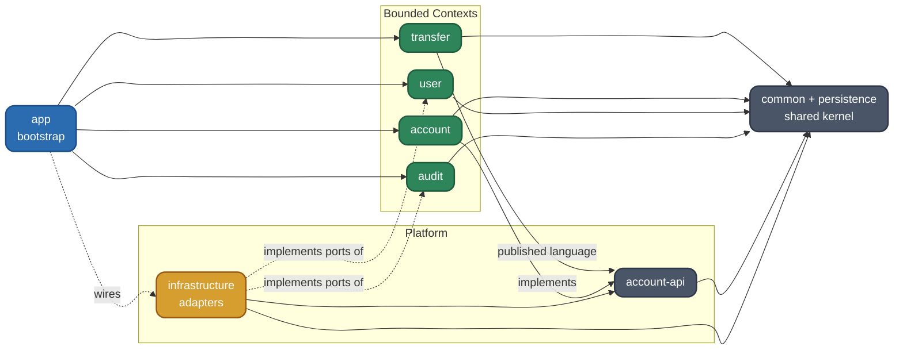

# Core Banking & Transfer System

A modular core banking and money transfer system built with **Spring Boot 3.5.x** and **Java 21**, strictly adhering to **Hexagonal Architecture (Ports and Adapters)** and **Clean Architecture** principles.

---

## Tech Stack & Prerequisites

### Core Framework & Language

- **Java 21:** Utilizes modern LTS features (e.g., Records, Pattern Matching).
- **Spring Boot 3.5.16:** Application backbone (Spring Web, AOP, Scheduling, Actuator).
- **Spring Security & JWT:** Stateless authentication and token blacklisting.

### Data & Caching

- **PostgreSQL 15:** Relational database with full transaction isolation and optimistic locking.
- **Flyway:** Automated database migration and schema version control. Migrations run on startup (`spring.jpa.hibernate.ddl-auto=validate`) to guarantee schema consistency with JPA entities.
- **Redis 7:** Caching, login attempts storage, and sliding window rate limiting (via Lua scripts).
- **Caffeine Cache:** Primary account-snapshot cache in every environment (60s TTL); also the default backend for rate limiting, login attempts, and token blacklist (production switches those three to Redis).
- **Micrometer + Prometheus:** Custom business metrics (outbox, orphan alarms) scraped via Actuator.
- **springdoc-openapi:** Swagger UI for API exploration (disabled in production).

### Quality Assurance & Testing

- **JUnit 5 & Mockito:** Standard test suites and mocking.
- **Testcontainers:** Integration testing with a single shared PostgreSQL container (plus per-test Redis containers where needed).
- **ArchUnit:** Architecture verification to enforce Hexagonal boundary rules.
- **JaCoCo:** Quality gates enforcing $\ge 80\%$ Line and $\ge 70\%$ Branch coverage.
- **Pitest:** Mutation testing quality gate enforcing $\ge 80\%$ mutation coverage to verify test assertion strength.

### DevOps & Prerequisites

- **Docker & Docker Compose:** Multi-container orchestration.
- **Kubernetes:** Production-ready manifests in `k8s/` (Deployment with rolling updates, HPA, PDB, probes, secret refs).
- **Maven 3.9.x:** Recommended build system (Maven 3.9.16 wrapper configuration is pre-configured).
- **Prerequisites:** Java 21 JDK, Docker installed.
- **Environment:** All variables documented in `.env.example` (DB, Redis, JWT, rate-limit, outbox, cache, integrity).

---

## Architecture & Module Dependency

The project follows Hexagonal Architecture rules where the domain core remains isolated from framework dependencies, and adapters depend strictly on ports. Dependency flows **inward**: infrastructure adapters depend on domain modules, never the reverse.

### Module Breakdown:

Modules fall into three categories: **platform** (stable, shared, no BC dependencies),
**bounded contexts** (hexagonal slices, independently understandable), and **bootstrap**.

- **`app`** [Bootstrap]: Bootstraps the application (`BankApplication`) and wires all modules together. Houses all integration and WebMvc tests, plus the `OrphanIntegrityReporter` scheduled job (read-only No-FK compensating observer).
- **`common`** [Platform — shared kernel]: Framework-independent shared domain models, value objects, exceptions, and generic cross-cutting ports (`ClockProviderPort`, `IdempotencyPort`, `EventPublisherPort`, `SecurityContextPort`, `AuthenticatedPrincipalPort`). Security-token ports (`JwtPort`, `TokenBlacklistPort`) live in `user`, not here.
- **`persistence`** [Platform]: Shared JPA base types (`AuditableJpaEntity` with Spring Data auditing). Kept as a separate module so `common` stays framework-free; `account`, `transfer` and `user` entities extend it without depending on `infrastructure`.
- **`account-api`** [Platform — published language]: Open Host Service of the Account context (`AccountApi`, `AccountSnapshot`, `AccountAdjustmentResult`) plus the shared snapshot-cache contract (`AccountSnapshotCache` + framework-free base). The only account-related contract downstream contexts may depend on; implemented by `account` via `AccountApiAdapter`.
- **`infrastructure`** [Platform]: Security filter chain, JWT/token-blacklist backends (implementing `user`-owned ports, with local fallback when Redis is down), outbox poller/processor, Redis/Caffeine adapters (incl. the Caffeine backend for the `account-api` snapshot cache), and global exception handling. Depends on BC port abstractions — never on BC adapter (concrete) classes, never on `account` internals.
- **`user`** [BC]: User registration, authentication, token lifecycle. Owns `JwtPort`, `TokenBlacklistPort`, `ClientIpResolverPort` and `LoginAttemptPort` — their implementations live in `infrastructure` (token/backends) or colocated adapters. Login runs as `@ReadOnlyUseCase` (DB reads only; login-attempt state lives in Redis, outside the DB transaction).
- **`account`** [BC]: Bank account lifecycle, balance mutations, and details. Implements `account-api`. Publishes its own domain events; callers only see the opaque `AccountAdjustmentResult`.
- **`transfer`** [BC]: Fund transfers, cancellations (24-hour window), and reporting. Defines `AccountAclPort` (with owned `AccountInfo` + `MutationResult` types) as its outbound port; implements it via `AccountAclAdapter` + in-memory fallback, delegating to `account-api`. Snapshot caching goes through the `account-api` cache contract (infrastructure Caffeine backend, in-memory fallback in transfer). Depends on `account-api` at compile time — never on `account`; `account` does not depend on `transfer`. Money-movement endpoints (`POST /transfers`, `POST /transfers/{id}/cancel`) require `Idempotency-Key` (`@Idempotent(required=true)`).
- **`audit`** [Supporting]: Transactional audit logging triggered by commit-phase domain events via `@TransactionalEventListener(AFTER_COMMIT)`.

**Module dependencies** (arrow = compile-time dependency direction; dashed arrow = port implementation):


```mermaid
%%{init: {'flowchart': {'rankSpacing': 0, 'nodeSpacing': 25, 'curve': 'natural', 'padding': 0}}}%%
graph LR
    classDef boot fill:#2B6CB0,stroke:#1A4E8A,color:#fff,stroke-width:2px,rx:12,ry:12;
    classDef ctx fill:#2F855A,stroke:#1F5C3D,color:#fff,stroke-width:2px,rx:12,ry:12;
    classDef plat fill:#4A5568,stroke:#2D3748,color:#fff,stroke-width:2px,rx:12,ry:12;
    classDef infraC fill:#D69E2E,stroke:#975A16,color:#fff,stroke-width:2px,rx:12,ry:12;

    app[app<br/>bootstrap]:::boot

    subgraph contexts[Bounded Contexts]
        direction TB
        transfer[transfer]:::ctx
        account[account]:::ctx
        user[user]:::ctx
        audit[audit]:::ctx
    end

    subgraph platform[Platform]
        direction TB
        api[account-api]:::plat
        infra[infrastructure<br/>adapters]:::infraC
    end

    shared[common + persistence<br/>shared kernel]:::plat

    app --> transfer & account & user & audit
    app -. wires .-> infra
    transfer -- published language --> api
    account -- implements --> api
    transfer & account & user & audit --> shared
    api --> shared
    infra --> shared & api
    infra -. implements ports of .-> user & audit
```

| Rule                                        | Meaning                                                                                                                                                      |
| :------------------------------------------ | :----------------------------------------------------------------------------------------------------------------------------------------------------------- |
| `transfer` → `account` **forbidden**        | Transfer must never touch the account module at compile time — `account-api` only                                                                            |
| `infrastructure` → BC adapter **forbidden** | Infra implements ports owned by the contexts, never uses concrete adapter classes                                                                            |
| No-FK (V19/V22)                             | `accounts.user_id`, `transfers.*_account_id` are not FKs (V3 leftovers dropped in V22); integrity lives in the application layer + `OrphanIntegrityReporter` |

> The full dependency matrix is enforced at build time by the architecture test suite (`app/.../architecture/`: domain-purity, layering, module-boundary and naming rules); the above are the only three rules you need to know.

> [!NOTE]
> `transfer` never depends on the `account` module — only on its published language (`AccountApi`). Balance mutations return transfer-owned results, account events never cross the boundary, and cached snapshots are invalidated per-account so stale reads cannot occur.

---

## REST API Endpoints (v1)

All request paths are prefixed with `/api/v1`. Endpoints below require a JWT bearer token except registration and login.

| Module       | Endpoint                         | Method | Description                                                                      | Special Headers / Notes         |
| :----------- | :------------------------------- | :----- | :------------------------------------------------------------------------------- | :------------------------------ |
| **User**     | `/auth/register`                 | `POST` | Register a new user                                                              | `Idempotency-Key` (Recommended) |
| **User**     | `/auth/login`                    | `POST` | Log in and obtain JWT                                                            | Brute-force & Rate-limited      |
| **User**     | `/auth/logout`                   | `POST` | Log out and blacklist token                                                      | `Authorization: Bearer <token>` |
| **Account**  | `/accounts`                      | `POST` | Create a new bank account                                                        | `Authorization: Bearer <token>` |
| **Account**  | `/accounts`                      | `GET`  | List current user's accounts (Paged)                                             | `Authorization: Bearer <token>` |
| **Account**  | `/accounts/{id}`                 | `GET`  | Query account details by ID                                                      | `Authorization: Bearer <token>` |
| **Account**  | `/accounts/iban/{iban}`          | `GET`  | Query account details by IBAN                                                    | `Authorization: Bearer <token>` |
| **Transfer** | `/transfers`                     | `POST` | Execute a money transfer                                                         | `Idempotency-Key` (Required)    |
| **Transfer** | `/transfers/{id}`                | `GET`  | Query transfer details by ID                                                     | `Authorization: Bearer <token>` |
| **Transfer** | `/transfers/{id}/cancel`         | `POST` | Cancel a transfer (< 24 hours)                                                   | `Idempotency-Key` (Required)    |
| **Transfer** | `/transfers/history/{accountId}` | `GET`  | Fetch transfer history (Paged)                                                   | `Authorization: Bearer <token>` |
| **Transfer** | `/transfers/report`              | `GET`  | Export date-range report (page-scoped totals: `pageTransferCount`, `pageVolume`) | `Authorization: Bearer <token>` |

---

## Key Features & Design Decisions

- **Hexagonal Architecture (Ports & Adapters):** All bounded context modules (`account`, `transfer`, `user`, `audit`) are compile-time independent of `infrastructure`. Infrastructure adapters depend on context-owned ports, never on concrete adapter classes (e.g. `SecurityContextAdapter` consumes the framework-free `AuthenticatedPrincipalPort`, not `CustomUserDetails`). Ports are owned by their defining module — `AccountAclPort` lives in `transfer.application.port.out`, `JwtPort`/`TokenBlacklistPort` in `user.application.port.out`, the `AccountApi` published language and snapshot-cache contract in `account-api`.
- **AOP Programmatic Transactions (`UseCaseTransactionAspect`):** Isolates transaction management from business use cases. Audit events are published via `ApplicationEventPublisher` within the transaction boundary and consumed by `@TransactionalEventListener(phase = TransactionPhase.AFTER_COMMIT)`, ensuring audit logging is only persisted on successful commit.
- **Transactional Outbox:** Reliably publishes domain events via the `outbox_events` database table with per-partition polling, concurrent-safe claiming, and idempotent handlers (at-most-once processing across restarts and retries).
- **Optimistic Concurrency Control (OCC):** Prevents lost updates and double-spending on `Account` and `Transfer` entities via Hibernate `@Version`.
- **Sorted Resource Locking (Deadlock Prevention):** Acquires database locks in a consistent, sorted order of account IDs (via `OrderedPair`) during debit/credit operations to prevent deadlocks under high-concurrency transfers.
- **Bounded Context Decoupling (Anti-Corruption Layer - ACL):** The `transfer` and `account` modules communicate only through the `account-api` published language (Open Host Service), consumed via transfer's `AccountAclPort` contract and implemented via `AccountAclAdapter` (in `transfer.adapter.out.account`) delegating to `AccountApi`. This protects the transfer domain from database or structure changes inside the account module, and account domain events never leak across the boundary.
- **AOP Idempotency Guard:** Protects write endpoints against duplicate submissions using a unique composite key stored in the `idempotency_keys` table. Authenticated endpoints use a `username_idempotencyKey` key; public endpoints (e.g., `/auth/register`) use a `clientIp_idempotencyKey` key via `ClientIpResolverPort`, configured with `@Idempotent(publicEndpoint = true)`.
- **Resilience:** Token blacklist degrades to a local per-token-TTL cache when Redis is unreachable (auth stays up); rate-limited responses carry `Retry-After`; login runs read-only against the DB.
- **Observability:** Structured JSON logs with correlation/trace/user IDs, Micrometer counters for outbox (`processed/failed/dead_letter`) and orphan alarms (`db.orphan.alarm`), Redis health indicator, Prometheus-ready Actuator endpoints.
- **Configuration:** All tunables are `@ConfigurationProperties` with env overrides documented in `.env.example` (timeouts, TTL bounds, retry/backoff, cron schedules, alarm thresholds).

---

## Getting Started

You can run the entire system (databases, cache, and the application itself) with a single command, or build and run it locally.

### Option A: Run Everything via Docker Compose (Recommended)

To build and spin up PostgreSQL, Redis, and the Spring Boot application together:

```bash
docker-compose up --build
```

### Option B: Build & Run Locally

1. Start PostgreSQL and Redis containers:
   ```bash
   docker-compose up -d postgres redis
   ```
2. Compile and run the application using the Maven Wrapper:
   - **Linux/macOS:**
     ```bash
     ./mvnw clean package
     ./mvnw spring-boot:run -pl app
     ```
   - **Windows (PowerShell):**
     ```powershell
     .\mvnw.cmd clean package
     .\mvnw.cmd spring-boot:run -pl app
     ```
     _(Note: Testcontainers will spin up a PostgreSQL instance automatically during the test lifecycle)_

- **Swagger UI:** `http://localhost:8080/swagger-ui/index.html`
- **Actuator Health:** `http://localhost:8080/actuator/health`

---

## Testing & Quality Gates

- **Test Suite (1500+ tests):** Unit tests reside in their respective modules; integration (Testcontainers) and WebMvc tests live mostly in the `app` module, with adapter-level integration tests colocated in `infrastructure`.
- **Verify Architecture Boundaries (ArchUnit):** Boundary rules from the table above, verified automatically on every build.
- **Integration Testing with Testcontainers & Flyway:** Integration tests run against a real PostgreSQL via Testcontainers with Flyway migrations and `ddl-auto=validate` for schema consistency.
- **Generate Coverage Report (JaCoCo):** `./mvnw jacoco:report` (or `.\mvnw.cmd jacoco:report`)
- **Run Mutation Testing (Pitest):** `./mvnw pitest:mutationCoverage` (or `.\mvnw.cmd pitest:mutationCoverage`)
