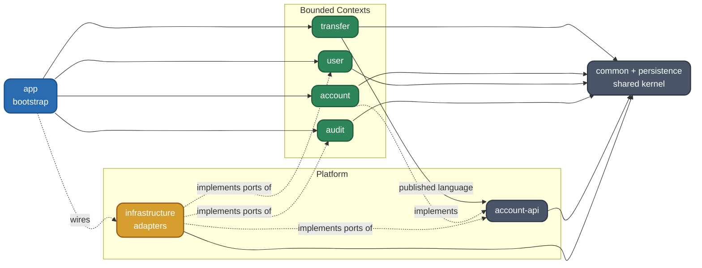

# Core Banking & Transfer System

A modular simulation of selected core banking workflows—account management and account-to-account transfers—built with **Spring Boot 3.5.16** and **Java 21**. It uses ports and adapters with architecture tests, PostgreSQL transactions, idempotency, and a browser UI. No real funds move, and this project is not a complete banking ledger or payment provider.

---

## Tech Stack & Prerequisites

### Core Framework & Language

- **Java 21:** Utilizes modern LTS features (e.g., Records, Pattern Matching).
- **Spring Boot 3.5.16:** Application backbone (Spring Web, AOP, Scheduling, Actuator).
- **Spring Security & JWT:** Bearer tokens for API clients; the same signed token is carried in an `HttpOnly` browser cookie with CSRF protection for the bundled UI. Logout revokes the token.

### Data & Caching

- **PostgreSQL 15:** Relational database with row locks, constraints, and Hibernate optimistic versions.
- **Flyway:** Database migrations run on startup; Hibernate's `ddl-auto=validate` checks the mapped schema and fails startup on detected mismatches.
- **Redis 7:** Shared account-snapshot cache in production, login attempts storage, and sliding window rate limiting (via Lua scripts).
- **Caffeine Cache:** Dev/test default (single-JVM, 60s TTL); production uses Redis for snapshots, rate limiting and login attempts, and PostgreSQL+Redis hybrid token revocation during migration.
- **Micrometer + Prometheus:** Custom outbox, idempotency-backlog and orphan-integrity metrics exposed via Actuator. A scraper and alert destination must be installed separately.
- **springdoc-openapi:** Swagger UI for API exploration (disabled in production).

### Quality Assurance & Testing

- **JUnit 5 & Mockito:** Standard test suites and mocking.
- **Testcontainers:** Integration testing with a single shared PostgreSQL container (plus per-test Redis containers where needed).
- **ArchUnit:** Architecture verification to enforce Hexagonal boundary rules.
- **JaCoCo:** Quality gates enforcing $\ge 80\%$ Line and $\ge 70\%$ Branch coverage.
- **Pitest:** A separate CI mutation-testing step is configured with a $\ge 80\%$ mutation threshold; it is not part of `test-all` or Maven `clean verify`.

### DevOps & Prerequisites

- **Docker & Docker Compose:** Multi-container orchestration.
- **Kubernetes:** Baseline manifests in `k8s/` (Deployment, HPA, PDB, probes). Secrets and PostgreSQL/Redis deployments are not included.
- **Maven 3.9.x:** Recommended build system (Maven 3.9.16 wrapper configuration is pre-configured).
- **Prerequisites:** Java 21 JDK and a running Docker daemon. The local test launcher also needs Python 3.10+ and Node.js.
- **Environment:** Common local variables are shown in `.env.example`; profile-specific settings and deployment checks are in [operations](docs/operations.md).

---

## Architecture & Module Dependency

The project follows Hexagonal Architecture rules where the domain core remains isolated from framework dependencies, and adapters depend strictly on ports. Dependency flows **inward**: infrastructure adapters depend on domain modules, never the reverse.

### Module Breakdown:

Modules fall into three categories: **platform** (stable, shared, no BC dependencies),
**bounded contexts** (hexagonal slices, independently understandable), and **bootstrap** —
plus one supporting module (`audit`).

- **`app`** [Bootstrap]: Bootstraps the application (`BankApplication`) and wires all modules together. Houses most integration and WebMvc tests, plus the `OrphanIntegrityReporter` scheduled integrity observer.
- **`common`** [Platform — shared kernel]: Framework-independent shared domain models, value objects, exceptions, and generic cross-cutting ports (`ClockProviderPort`, `IdempotencyPort`, `EventPublisherPort`, `SecurityContextPort`, `AuthenticatedPrincipalPort`). Security-token ports (`JwtPort`, `TokenBlacklistPort`) live in `user`, not here.
- **`persistence`** [Platform]: Shared JPA base types (`AuditableJpaEntity` with Spring Data auditing). Kept as a separate module so `common` stays framework-free; `account`, `transfer` and `user` entities extend it without depending on `infrastructure`.
- **`account-api`** [Platform — published language]: Open Host Service of the Account context (`AccountApi`, `AccountSnapshot`, `AccountAdjustmentResult`) plus the shared snapshot-cache contract (`AccountSnapshotCache` + framework-free base). The only account-related contract downstream contexts may depend on; implemented by `account` via `AccountApiAdapter`.
- **`infrastructure`** [Platform]: Security filter chain, JWT/token-blacklist backends (implementing `user`-owned ports; production revocations are stored durably in PostgreSQL and checked alongside legacy Redis records), outbox poller/processor, Redis/Caffeine adapters (incl. the backend-selected `account-api` snapshot cache: Caffeine single-JVM for dev/test, Redis shared for production), and global exception handling. Depends on BC port abstractions — never on BC adapter (concrete) classes, never on `account` internals.
- **`user`** [BC]: User registration, authentication, token lifecycle. Owns `JwtPort`, `TokenBlacklistPort`, `ClientIpResolverPort` and `LoginAttemptPort` — their implementations live in `infrastructure` (token/backends) or colocated adapters. Login uses short read-only transactions for credential/user lookup; login-attempt state is handled outside those DB transactions (Redis in production, Caffeine locally).
- **`account`** [BC]: Bank account lifecycle, balance mutations, and details. Implements `account-api`. Publishes its own domain events; callers only see the opaque `AccountAdjustmentResult`.
- New account creation derives the owning user from the authenticated principal and generates a checksum-valid, simulation-only Turkish IBAN. Earlier format-only records remain readable; see [IBAN rollout](docs/iban-checksum-rollout.md) before using an existing database.
- **`transfer`** [BC]: Simulated transfers, conditional cancellations (a configurable window and sufficient recipient balance), and paginated reporting. Talks to `account` only via the `account-api` published language; transfer and cancellation endpoints require `Idempotency-Key`.
- **`audit`** [Supporting]: Mandatory audit persistence for money movements participates in the use-case transaction; a failed write rolls the movement back.

**Module dependencies** (arrow = compile-time dependency direction; dashed arrow = port implementation or composition-root wiring):


```mermaid
%%{init: {'flowchart': {'rankSpacing': 0, 'nodeSpacing': 25, 'curve': 'natural', 'padding': 0}}}%%
graph LR
    classDef boot fill:#2B6CB0,stroke:#1A4E8A,color:#fff,stroke-width:2px,rx:12,ry:12;
    classDef ctx fill:#2F855A,stroke:#1F5C3D,color:#fff,stroke-width:2px,rx:12,ry:12;
    classDef plat fill:#4A5568,stroke:#2D3748,color:#fff,stroke-width:2px,rx:12,ry:12;
    classDef infraC fill:#D69E2E,stroke:#975A16,color:#fff,stroke-width:2px,rx:12,ry:12;

    app[app<br/>bootstrap]:::boot

    subgraph contexts[Bounded Contexts]
        direction TB
        transfer[transfer]:::ctx
        account[account]:::ctx
        user[user]:::ctx
        audit[audit]:::ctx
    end

    subgraph platform[Platform]
        direction TB
        api[account-api]:::plat
        infra[infrastructure<br/>adapters]:::infraC
    end

    shared[common + persistence<br/>shared kernel]:::plat

    app --> transfer & account & user & audit
    app -. wires .-> infra
    transfer -- published language --> api
    account -. implements .-> api
    transfer & account & user & audit --> shared
    api --> shared
    infra --> shared
    infra -. implements ports of .-> api & user & audit
```

| Rule                                        | Meaning                                                                                                                                                      |
| :------------------------------------------ | :----------------------------------------------------------------------------------------------------------------------------------------------------------- |
| `transfer` → `account` **forbidden**        | Transfer must never touch the account module at compile time — `account-api` only                                                                            |
| `infrastructure` → BC adapter **forbidden** | Infra implements ports owned by the contexts, never uses concrete adapter classes                                                                            |
| Scalar IDs with DB FKs                    | Java modules use scalar references; V24 restores PostgreSQL foreign keys for user/account/transfer integrity. `OrphanIntegrityReporter` remains an observer. |

> The full dependency matrix is enforced at build time by the architecture test suite (`app/.../architecture/`: domain-purity, layering, module-boundary and naming rules); the above are the only three rules you need to know.

> [!NOTE]
> `transfer` never depends on the `account` module — only on its published language (`AccountApi`). Balance mutations return transfer-owned results, account events never cross the boundary, and account mutations invalidate affected cached snapshots.

---

## REST API Endpoints (v1)

All request paths are prefixed with `/api/v1`. Protected endpoints accept `Authorization: Bearer <token>` for API clients or the bundled UI's same-origin browser cookie. Unsafe cookie-authenticated requests also require `X-CSRF-Token`; see the [browser session contract](docs/browser-session.md). Registration and both login endpoints are public. The auth, account-create and transfer paths have rate limits.

| Module | Endpoint | Method | Description / notes |
| :--- | :--- | :--- | :--- |
| User | `/auth/register` | `POST` | Register; `Idempotency-Key` recommended. |
| User | `/auth/login` | `POST` | Obtain a bearer JWT for API clients. |
| User | `/auth/logout` | `POST` | Revoke the bearer JWT. |
| User | `/auth/browser/login` | `POST` | Set `HttpOnly` session and readable CSRF cookies; no token in JSON. |
| User | `/auth/browser/session` | `GET` | Restore the browser session. |
| User | `/auth/browser/logout` | `POST` | Revoke the cookie session; requires CSRF header. |
| Account | `/accounts/capabilities` | `GET` | Report whether simulated opening funds are enabled. |
| Account | `/accounts` | `POST` | Open an account for the authenticated user; the server generates a simulation-only Turkish IBAN. `Idempotency-Key` recommended. |
| Account | `/accounts` | `GET` | List the authenticated user's accounts (paged). |
| Account | `/accounts/{id}`, `/accounts/iban/{iban}` | `GET` | Return only an account owned by the caller. |
| Transfer | `/transfers` | `POST` | Execute a simulated transfer; `Idempotency-Key` required. |
| Transfer | `/transfers/{id}` | `GET` | Query transfer details. |
| Transfer | `/transfers/{id}/cancel` | `POST` | Conditionally reverse a completed transfer; `Idempotency-Key` required. |
| Transfer | `/transfers/history/{accountId}` | `GET` | Paged transfer history. |
| Transfer | `/transfers/report` | `GET` | Paged date-range report with `pageTransferCount`, `pageVolume` and `hasNext`; not a full-range export. |

---

## Key Features & Design Decisions

- **Hexagonal Architecture (Ports & Adapters):** Bounded contexts (`account`, `transfer`, `user`, `audit`) never depend on `infrastructure`; infrastructure implements context-owned ports, and each port lives in its owning module.
- **AOP Programmatic Transactions (`UseCaseTransactionAspect`):** Isolates transaction management from business use cases. Mandatory audit records are saved through `AuditEventPublisherAdapter` in the caller's transaction, so an audit write failure rolls back the associated money movement.
- **Transactional Outbox:** Reliably publishes domain events via the `outbox_events` database table with per-partition polling, `SKIP LOCKED` row selection, and idempotent handlers (at-least-once delivery across restarts and retries; events that exhaust retries go to dead letter). The initial batch lock ends after selection; processing reacquires each event lock in a separate transaction. Partition changes, dead letters, and retention are covered in [outbox operations](docs/outbox-operations.md).
- **Optimistic Concurrency Control (OCC):** Hibernate `@Version` rejects stale aggregate updates; transfer balance changes also use pessimistic account locks and domain balance checks.
- **Sorted Resource Locking:** Acquires pessimistic write locks (`SELECT ... FOR UPDATE`) in a consistent account-ID order (via `OrderedPair`) during debit/credit operations to reduce deadlock risk under concurrent transfers.
- **Bounded Context Decoupling (Anti-Corruption Layer - ACL):** The `transfer` and `account` modules communicate only through the `account-api` published language (Open Host Service), consumed via transfer's `AccountAclPort` contract and implemented via `AccountAclAdapter` (in `transfer.adapter.out.account`) delegating to `AccountApi`. This protects the transfer domain from database or structure changes inside the account module, and account domain events never leak across the boundary.
- **AOP Idempotency Guard:** Annotated account and transfer commands use `Idempotency-Key` records in the `idempotency_keys` table. Transfer and cancellation keys are required; account creation and registration keys are recommended.
- **Resilience:** Revocation lookup fails closed with 503 when a required store is unavailable; production starts in hybrid DB+Redis mode to preserve Redis-only revocations during rollout. See [token revocation migration](docs/token-revocation-migration.md) and the [operations runbook](docs/operations.md). Rate-limited responses carry `Retry-After`.
- **Observability:** JSON logs in production (plain text locally) with request correlation IDs; outbox/backlog and orphan-integrity metrics, Redis health indicator and Prometheus-ready Actuator endpoint. Scraping, alert routing and restore drills remain deployment tasks.
- **Simulation funding:** Local dev/test profiles allow simulated opening balances. A hosted simulation uses `prod,simulation` to keep production security settings; `prod` alone allows zero opening balance. The UI reads `/accounts/capabilities` and mirrors that policy. See [simulation mode](docs/simulation-mode.md).
- **Notifications:** Current email and SMS adapters log simulated notifications; no external delivery provider is connected.

---

## Getting Started

You can run PostgreSQL, Redis and the application together, or run Java on the host against Compose dependencies. The Compose defaults are for local development, not a public deployment.

### Option A: Run Everything via Docker Compose (Recommended)

Install and start Docker Desktop (with Docker Compose). Java, Maven, PostgreSQL and Redis do not need separate host installations. Clone the repository once, enter it, then build and start all three services while waiting for their health checks. If you are already in the repository root, run only the last command:

```bash
git clone https://github.com/BerkanApaydin/core-banking.git
cd core-banking
docker compose up --build --wait
```

Open the bundled UI at `http://localhost:8080/`. Compose creates the `bank_db` database, then the application's Flyway migrations create and update its tables automatically on startup. Hibernate validates the resulting schema. No manual SQL or `.env` file is needed for this local development setup. The first run downloads images and Maven dependencies, so it needs internet access and can take longer. Ports `5432`, `6389` and `8080` must be free on the host; use `docker compose logs --tail=100 app` if startup fails. `docker compose down` stops the services while preserving PostgreSQL data in its named volume.

Compose and the development scripts explicitly select `dev`, which permits **simulated** opening balances. A standalone application now defaults to `prod`; select `dev` explicitly for local use. To host the simulation with production security settings, use `prod,simulation` and supply deployment-managed secrets and TLS; see [simulation mode](docs/simulation-mode.md) and [operations](docs/operations.md). A plain `prod` profile permits only zero opening balance.

### Option B: Run Java on Your Computer

From the repository root, use the launcher for your operating system (Java 21, Docker and Docker Compose required):

```powershell
# Windows PowerShell or Command Prompt
.\start-app-dev.cmd
```

```bash
# Linux/macOS
bash start-app-dev.sh
```

The launcher stops the Compose app container if it is running, waits for PostgreSQL and Redis, builds the app with tests skipped, then serves the UI at `http://localhost:8080/`. It supplies the Compose database credentials and host Redis port (`6389`) and generates a fresh JWT secret automatically. No `.env` file or manual environment setup is needed. A fresh secret logs out existing browser sessions on each restart. Press Ctrl+C to stop Java; `docker compose down` stops the dependency containers. Run `test-all.cmd` (Windows) or `bash test-all.sh` (macOS/Linux) separately for the standard test suites and coverage checks.

- **Swagger UI (local profiles):** `http://localhost:8080/swagger-ui/index.html` (disabled in `prod`)
- **Actuator Health:** `http://localhost:8080/actuator/health`

---

## Testing & Quality Gates

- **Run standard local checks:** `test-all.cmd` on Windows or `bash test-all.sh` on macOS/Linux. The launchers run Maven `clean verify`, enforce aggregate JaCoCo coverage, then run the offline Python checks, JavaScript syntax checks, and browser contract tests. Java 21, a running Docker daemon (for Testcontainers), Python 3.10+, and Node.js are required. The command stops at the first failure and returns a nonzero exit code. PIT mutation testing, live health smoke, and data-writing load tests are separate checks.
- **Test Suite:** Unit tests reside in their respective modules; integration (Testcontainers) and WebMvc tests live mostly in `app`, with adapter-level integration tests also in `infrastructure`.
- **Verify Architecture Boundaries (ArchUnit):** Boundary rules from the table above, verified automatically on every build.
- **Integration Testing with Testcontainers & Flyway:** Integration tests run against a real PostgreSQL via Testcontainers with Flyway migrations and `ddl-auto=validate` for schema consistency.
- **Generate Coverage Report (JaCoCo):** `./mvnw clean verify` (or `.\mvnw.cmd clean verify` on Windows) runs unit and Testcontainers integration tests, then writes the nine-module report to `app/target/site/jacoco-aggregate/index.html`. The VS Code task **JaCoCo: Run All Tests + Aggregate Coverage** uses this lifecycle and prints each module directly from the aggregate XML. VS Code's **Run Tests with Coverage** button uses the Java Test Runner's separate, project-by-project coverage view; its intermediate percentages are not the Maven aggregate quality gate.
- **Browser contract checks:** `node app/src/test/js/idempotency.test.js` and `node app/src/test/js/frontend_contract.test.js` exercise session/idempotency, report pagination and funding-capability behavior. CI runs both; a real browser/TLS acceptance test is not yet included.
- **CI dependency checks:** CI is configured to reject newly introduced high/critical dependency advisories on pull requests and to publish an aggregate CycloneDX SBOM. These checks do not replace a review of vulnerabilities already present in the dependency baseline.
- **Operational checks:** The read-only [health smoke](docs/operations.md) validates health and anonymous authorization responses. The [load-test guide](load_tests/README.md) separates rate-limit verification from data-writing capacity tests on an isolated simulation deployment.
- **Run Mutation Testing (Pitest) separately:** On a fresh checkout, first run `./mvnw clean install` (or `.\mvnw.cmd clean install` on Windows) so all reactor JARs, including the shared test JAR, are available to PIT's separate invocation. Then run `./mvnw pitest:mutationCoverage -Dpitest.skip=false` (or `.\mvnw.cmd pitest:mutationCoverage -Dpitest.skip=false` on Windows). CI follows the same sequence.
